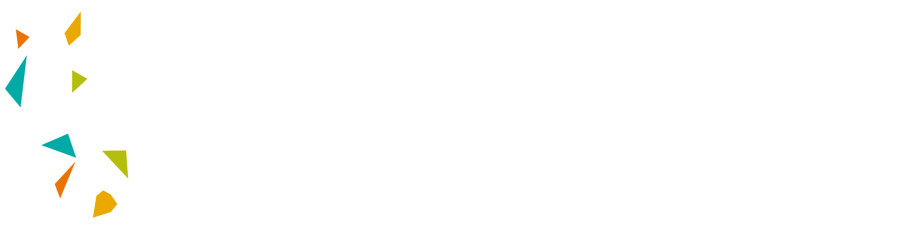

# KAUST Academy Artificial Intelligence Summer 2025 - Tahakom

This is the base Repository for the KAUST Academy Summer School that will be held in two locations across the world.

1. Riyadh, Saudi Arabia
2. Oxford University, England

## Program Overview

The KAUST Academy Artificial Intelligence Summer School 2025 is designed to provide participants with an in-depth understanding of key AI domains, including Computer Vision, and Natural Language Processing and Deep unsupervised learning, the program will span seven weeks two of which will be held online.

## Instructors

- Riyadh:
  - [Dr. Jean Lahoud](https://www.linkedin.com/in/jean-lahoud-4179ab284/)

- Oxford:
  - [Prof. Naeemullah Khan](https://www.linkedin.com/in/profkhan/?originalSubdomain=sa)
  - [Prof. George Turkiyyah](https://cemse.kaust.edu.sa/profiles/george-turkiyyah)
  - [Dr. Prashant Aparajeya](https://www.linkedin.com/in/prashant-aparajeya/?originalSubdomain=uk)
  - [Dr. Tanveer Hussain](https://www.linkedin.com/in/tinu445/)
  - [Dr. Muhammad Mubashar](https://www.linkedin.com/in/muhammad-mubashar-719b05167/?originalSubdomain=uk)
  - [Dr. Ankuj Arora](https://www.linkedin.com/in/ankuj-arora-ph-d-94777421/)
  - [Dr. Annie]

## Teaching Assistants

- [Ali Habibullah](https://www.linkedin.com/in/ali-habibullah/)
- Azzam Turkistani
- [Lorena Gallo Larco](https://www.linkedin.com/in/lorenagallolarco/?originalSubdomain=sa)

## 🏆 Certification

Participants who successfully complete the program, meet the attendance requirements, and submit the final deliverables will receive a Certificate of Completion from KAUST Academy, signed by:

- Prof. Naemmullah Khan, Deputy Director, KAUST Academy | Instructional Assistant Professor, KAUST | Associate Research Fellow, LMH, University of Oxford
- Prof. Sultan Albarakati, Associate Vice President, Saudi Talent Development, KAUST

Final deliverables include:

- A comprehensive project report
- A presentation poster
- A before and after MCQ Exam

Maintained by The Teaching Team
